# 1. Visão de sistema

> **Medido contra:** `96a85934` (HEAD da `pre-prod`) · **em** 2026-08-31 · por Altair (Arquiteto)
> **Scaffold nesta vista:** `platform-*` é nascente (domínio escrito, borda em fatias); **Astro tem 0 código** (só documentos em `docs/astro/`).

## O que esta vista responde

Que peças existem, em que linguagem vivem, e **quem depende de quem**. Não mostra dados a correr — isso é o [diagrama 2](02-fluxo-de-dados.md).

```mermaid
flowchart TB
    subgraph desktop["Aplicação desktop (Tauri 2)"]
        UI["<b>src/</b> — React + TypeScript<br/>telas, componentes, store"]
        IPC["IPC Tauri<br/>(comandos tipados)"]
        APP["<b>src-tauri/</b> — crate app<br/>Rust, MSRV 1.85"]
        UI --> IPC
        IPC --> APP
    end

    subgraph membros["Membros da suite (dentro do desktop)"]
        NAV["Navigator<br/><i>browser.rs · bookmarks.rs · favicon.rs</i>"]
        FILES["Files<br/><i>fs_explorer.rs</i>"]
        OD["OneDrive / M365<br/><i>graph.rs</i>"]
        GD["Google Drive<br/><i>gdrive.rs</i>"]
        REM["Remote<br/><i>remote.rs · remote_identity.rs</i>"]
        BRI["Bridge"]
        AST["Astro<br/><i>0 código — só docs</i>"]
    end

    APP --> NAV
    APP --> FILES
    APP --> OD
    APP --> GD
    APP --> REM
    APP --> BRI
    APP -.->|"planeado — 0 código"| AST

    subgraph rust_remote["services/remote-* — 8 crates"]
        RNET["remote-net<br/><i>fronteira congelada v2:<br/>enrolamento, auth, sessão</i>"]
        RTRANS["remote-transport<br/><i>str0m sans-I/O, DTLS-SRTP</i>"]
        RCAP["remote-capture<br/><i>WGC / DesktopDup + H.264</i>"]
        RCAPS["remote-capabilities<br/><i>vocabulário único (crate folha)</i>"]
        RSIG["remote-signaling<br/><i>servidor de sinalização</i>"]
        RBROKER["remote-broker-client<br/><i>lado owner do pipe S7</i>"]
        RAGENT["remote-system-agent<br/><i>worker privilegiado</i>"]
        RHELPER["remote-system-helper<br/><b>Delphi</b> — broker SCM/sessão"]
    end

    subgraph rust_platform["services/platform-* — 9 crates, nascente"]
        PIDENT["platform-identity<br/><i>fundação: principal, tenancy,<br/>papel, default-deny</i>"]
        PCONC["platform-concessao<br/><i>2.º eixo: o que foi CONCEDIDO</i>"]
        PHTTP["platform-http<br/><i>borda axum (Router)</i>"]
        POAUTH["platform-oauth<br/><i>decisão OAuth (sem I/O)</i>"]
        PWEB["platform-web<br/><i>SessaoId + cookie</i>"]
        PORG["platform-org-admin"]
        PBO["platform-back-office<br/><i>STAFF-ONLY</i>"]
        PCONTA["platform-conta<br/><i>/me</i>"]
        PCFG["platform-config"]
    end

    WEB["<b>web/</b> — front da plataforma<br/>workspace pnpm (1 membro)"]

    REM --> RNET
    REM --> RTRANS
    REM --> RCAP
    RNET -.->|concede ticket| RCAPS
    RTRANS -.->|aplica| RCAPS
    REM -.->|"feature remote (OFF por omissão)"| RTRANS
    RBROKER -->|pipe v1 congelado| RHELPER
    RHELPER --> RAGENT
    APP --> RBROKER

    WEB --> PHTTP
    PHTTP --> PIDENT
    PHTTP --> POAUTH
    PHTTP --> PWEB
    PHTTP --> PCONC
    PORG --> PIDENT
    PBO --> PIDENT
    PCONTA --> PIDENT
    PCFG --> PIDENT
    PHTTP --> PORG
    PHTTP --> PBO
    PHTTP --> PCONTA
    PHTTP --> PCFG
    RSIG -.->|"serve o endpoint de sinalização"| RNET

    classDef scaffold stroke-dasharray: 5 5;
    class AST,PIDENT,PCONC,PHTTP,POAUTH,PWEB,PORG,PBO,PCONTA,PCFG scaffold;
```

## O que o diagrama não diz, e é preciso saber

**1. A feature `remote` está DESLIGADA por omissão.** `src-tauri/Cargo.toml` declara `default = []`; sem `--features remote` os comandos `remote_*` viram *stubs* com erro claro (`remote_stub.rs`) e o front degrada. A razão é de build, não de produto: `remote` arrasta `openssl/vendored`, que compila OpenSSL da fonte.

**2. `remote-capabilities` é crate FOLHA de propósito.** `remote-net` **concede** e `remote-transport` **aplica** — são pares, nenhum abaixo do outro. Se o vocabulário vivesse num deles, criava uma dependência entre irmãos que a topologia não justifica. Depende só de `serde`: sem runtime, sem async, sem OpenSSL.

**3. `remote-system-helper` é Delphi, não Rust.** É o broker que detém SCM/sessão/IPC; o Rust fala com ele pelo **pipe congelado v1** (`\\.\pipe\Galaxie.Remote.System.v1`). Nenhuma credencial atravessa esse pipe.

**4. A chave privada do device vive no Rust.** `remote_identity.rs` guarda a Ed25519 do device e **nunca** a passa ao WebView — o TypeScript só pede a chave *pública* ou uma assinatura. É invariante testada, não convenção.

**5. `platform-*` divide domínio de borda deliberadamente.** `platform-oauth` **decide** o que os bytes significam; `platform-http` **busca** os bytes. A segurança fica em crates puros e testáveis, fora do I/O.
