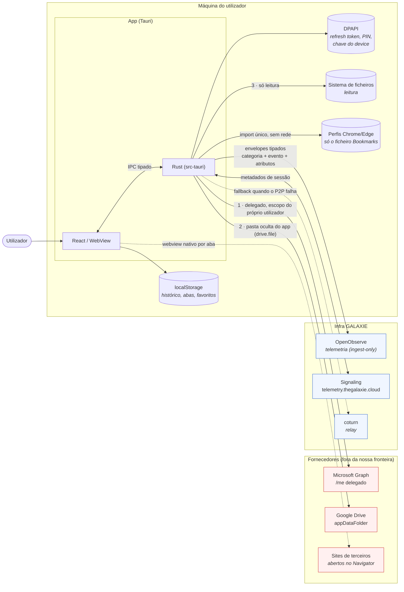

# 2. Fluxo de dados

> **Medido contra:** `96a85934` (HEAD da `pre-prod`) · **em** 2026-08-31 · por Altair (Arquiteto)
> **Scaffold nesta vista:** nenhum — todos os caminhos abaixo existem em código.
> ⚠️ **Nota de medição:** o card do #1643 diz que esta vista *"complementa o `PRIVACY.md`"*. **Esse ficheiro não está na `pre-prod`** — existe apenas como **rascunho** na branch por mergear `mira/repo-hygiene-apache` (`5ee27519`, marcado *"p/ revisão jurídica"*). Este diagrama descreve o código; quando o `PRIVACY.md` landar, os dois têm de concordar — e **o código é a fonte**.

## O que esta vista responde

Por onde passa cada dado e, sobretudo, **qual a fronteira que ele atravessa**: fica na máquina, vai para um fornecedor, ou vai para a nossa infra.

## Os três caminhos de dado, e o que cada um garante

| # | caminho | âmbito | garantia estrutural |
|---|---|---|---|
| 1 | **Microsoft Graph** (`graph.rs`) | **delegado** — o que o utilizador já vê | o app age *como* o utilizador, nunca acima dele |
| 2 | **Google `appDataFolder`** (`gdrive.rs`) | pasta **oculta do app** | scope `drive.file`, **não** é *Drive-browse*: o app não consegue ler o Drive do utilizador |
| 3 | **Filesystem local** (`fs_explorer.rs`) | **só leitura** | não há comando de escrita nesta superfície |

## Fronteiras que valem por si

**O histórico do Navigator nunca sai da máquina.** `navigator-history.ts` guarda `{url, nome, ts}` em `localStorage`. Não há caminho dele para a telemetria nem para a rede — e a captura é só nos pontos em que o app **comita** uma URL (abrir app M365, omnibox, favorito). Sub-navegação dentro da página **não chega ao front** sem um hook nativo que não existe: portanto o app regista *menos* do que um browser normal, não mais.

**O import de favoritos lê um ficheiro e mais nada.** `bookmarks.rs` abre apenas `Bookmarks` (JSON) dos perfis Chrome/Edge — **nunca** `Login Data` nem qualquer ficheiro de credenciais. Sem rede, sem automação, sem *scraping*.

**A telemetria é envelope tipado, não texto livre.** O WebView manda `categoria + evento + atributos (enum/bucket)`; o Rust é que carimba o contexto (versão, canal, OS grosseiro, id de sessão efémero) e aplica a *policy* — consentimento por categoria, *denylist* de PII, tectos e amostragem. 🔑 **O front não consegue emitir uma string arbitrária para a telemetria**, e é isso que torna a política enforçável em vez de aspiracional. O token de ingestão é **ingest-only** e há guarda para não aparecer em log ou dump de headers.

**O que a DPAPI protege está preso a este utilizador desta máquina.** Refresh token, hash do PIN e a chave Ed25519 do device são cifrados com a credencial do utilizador Windows — copiar os ficheiros para outra conta **não** os torna legíveis. É isso que o [runbook de DR](../runbooks/dr-maquina-nova.md) explora na regra *copiar vs re-criar*.

**Os sites de terceiros são webviews nativos.** O Navigator não faz proxy do tráfego: cada aba é um webview filho e o tráfego dela vai directo ao site. O app posiciona e mostra/esconde; não lê o conteúdo.
