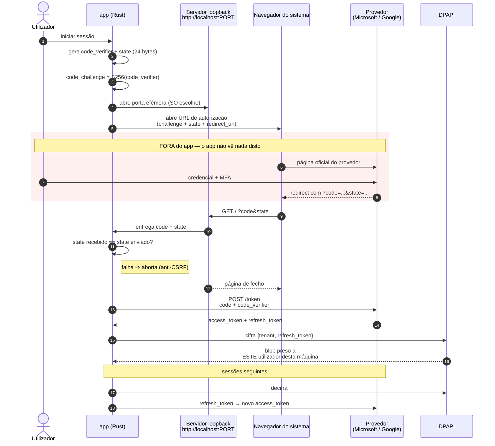

# 3. Sequência de auth — Authorization Code + PKCE

> **Medido contra:** `96a85934` (HEAD da `pre-prod`) · **em** 2026-08-31 · por Altair (Arquiteto)
> **Fonte:** `src-tauri/src/auth.rs`, `src-tauri/src/dpapi.rs`
> **Scaffold nesta vista:** nenhum — o fluxo está vivo para **Microsoft** e para **Google**, partilhando a mesma máquina de *loopback*.

## O que esta vista responde

Como uma credencial do utilizador vira uma sessão do app **sem que o app alguma vez a veja**.

## Porque cada peça está lá

**O app nunca vê a senha — e isso é estrutural, não uma promessa.** Quem recolhe credencial e MFA é a **página oficial do provedor**, aberta no navegador do sistema. O que volta ao app é um *authorization code*, inútil sozinho.

**O `code_verifier` é o que torna o code inútil para terceiros.** O código de autorização viaja por um redirect de *loopback* — um canal que outro processo local podia, em teoria, tentar apanhar. Sem o `code_verifier` (que nunca sai do processo), o code **não se troca por tokens**. 🔑 É por isso que PKCE não é opcional num cliente público: **não há segredo de cliente que se possa guardar num binário distribuído**, e o PKCE substitui esse segredo por um efémero por-fluxo.

**O `state` é uma verificação separada, e resolve outra coisa.** 24 bytes aleatórios, comparados à chegada. Protege contra **CSRF** — alguém induzir o loopback a aceitar um code que não foi este fluxo a pedir. ⚠️ `state` e `code_verifier` não são redundantes: um responde *"este redirect é da minha sessão?"*, o outro *"quem troca este code é quem o pediu?"*. Tirar qualquer um deixa um buraco que o outro não tapa.

**A porta é efémera e escolhida pelo SO.** Não há porta fixa a reservar nem a colidir com outro programa.

**O refresh token só existe cifrado em repouso.** `dpapi.rs` é o **wrapper único** de `CryptProtectData`/`CryptUnprotectData` — antes estava duplicado em `auth.rs` e `lock_screen.rs` (#1073). Uma cópia só significa **um lugar para auditar o `unsafe`**, e é a mesma disciplina de *"um vocabulário, um dono"* que aparece no [diagrama 1](01-visao-de-sistema.md).

**A sessão é *single-file*.** Um par `(provider, tenant, refresh)` de cada vez — trocar de provedor limpa o anterior. Evita a classe de bugs em que um refresh é usado contra a *authority* errada.

## Consequência para o DR

O blob DPAPI está preso ao **utilizador Windows** e à **máquina**. Copiá-lo para outra conta não o torna legível — o que faz de *"re-autenticar"*, e não *"restaurar ficheiro"*, o passo correto num desastre. Ver [`docs/runbooks/dr-maquina-nova.md`](../runbooks/dr-maquina-nova.md).
