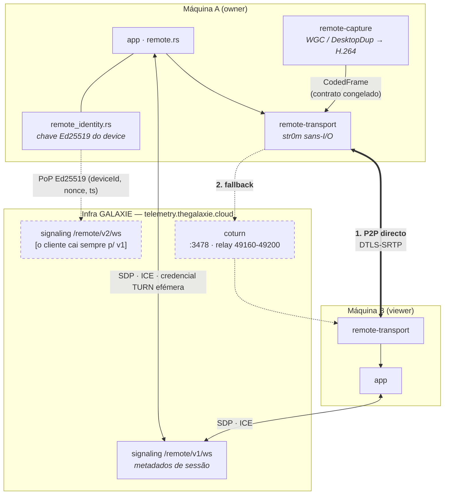
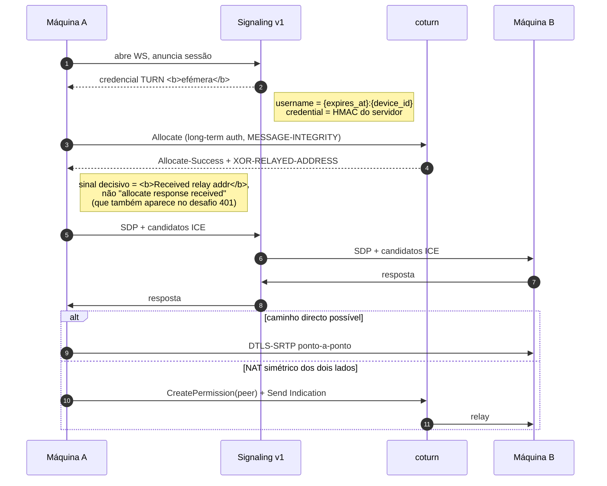

# 4. Remote — sinalização, P2P e relay TURN

> **Medido contra:** `96a85934` (HEAD da `pre-prod`) · **em** 2026-08-31 · por Altair (Arquiteto)
> **Config de produção medida por SSH** na VPS `telemetry` (`145.223.94.149`) na mesma data.
> **Scaffold nesta vista:** o **plano de controlo `/v2/ws`** existe no cliente (#1129) mas **o consumidor cai sempre para o v1**; a **travessia de NAT real** ainda não foi provada (#1130-b).

## O que esta vista responde

Como duas máquinas se encontram, e o que acontece quando não conseguem falar directamente.

## Sequência de uma sessão

## Factos medidos, e o que decorre deles

### A credencial TURN é efémera e emitida pelo nosso signaling

`username = {expires_at}:{device_id}`, `credential = HMAC` do servidor — o formato é **ditado pelo servidor**, não escolhido pelo cliente. Consequência prática: **atribuir uma corrida nos logs faz-se pelo `device_id`**, registando o dispositivo com um id distintivo (`prova-1666`), não inventando um username.

⚠️ **A ferramenta de prova (`turn_relay_probe`) não deriva a credencial do `turn_secret`** — exige `--credential` de um `Registered` v1 real. Derivar localmente provaria **matemática de HMAC**; exigir a credencial emitida prova **o caminho real de emissão**, que é a pergunta que interessa.

### O relay está fechado por baixo, e isso já mordeu um desenho meu

`turnserver.conf` em produção recusa `0.0.0.0/8`, `10/8`, `127/8`, `169.254/16`, `172.16/12`, `192.168/16`, mais `no-loopback-peers` e `no-multicast-peers`. O bloco tem o comentário de origem: *"o relay NÃO é proxy pra rede interna — sem isto um peer pode ser o 127.0.0.1 do VPS, onde moram o próprio signaling e a telemetria (forma de SSRF)"*.

🔑 **Duas consequências que só aparecem quando se mede:**

1. **A topologia *self-relay* não é provável contra a nossa produção.** Duas alocações na mesma máquina a relayar uma para a outra exigem que cada lado autorize como peer o **endereço do próprio coturn** — e o coturn devolve **403** nesse `CreatePermission` (medido, #1666). A prova da perna E2E de dados **exige um peer externo** (`--peer`), e por isso pertence ao #1130-b.
2. **`100.64.0.0/10` (CGNAT) NÃO está na lista de recusadas.** Um peer atrás de CGNAT de operador **passa a guarda** e continua **inalcançável** — a corrida falharia por razão de rede e leria como *"o relay não atravessa"*. Antes de qualquer prova com peer externo: confirmar que o endereço visto de fora é mesmo público.

### O plano de controlo v2 existe, mas não é o caminho vivo

`/v2/ws` está inteiro no cliente (`api.ts`, `remote-signaling-v2.ts`, `remote_identity.rs`) e traz **prova de posse Ed25519** — `(deviceId, nonce, timestamp)` assinados no Rust, com a chave privada a **nunca** cruzar para o WebView. O que falta é servidor: matrícula (#1132) e `ice_servers` (#1133). Até lá, **o consumidor cai sempre para o v1**.

### Fronteiras congeladas

| fronteira | contrato | porquê congelada |
|---|---|---|
| encoder ↔ transporte | `CodedFrame` | o formato de frame não pode oscilar com refactor de nenhum dos lados |
| transporte ↔ signaling | `SignalingChannel` + `SignalMessage` | permite trocar o transporte de sinalização sem tocar no WebRTC |
| owner ↔ broker (S7) | pipe `Galaxie.Remote.System.v1` | atravessa a fronteira de privilégio; **nenhuma credencial passa nele** |
| concede ↔ aplica | `remote-capabilities` | `remote-net` concede, `remote-transport` aplica; o vocabulário mora num terceiro crate para não criar dependência entre irmãos |

### Tectos ainda por calibrar

`user-quota=64` e `total-quota=1200` trazem no próprio ficheiro o aviso: *"números são ponto de partida, NÃO medição — calibrar com sessão real (#1130)"*. **A corrida do #1130-b é essa sessão** — a quota deve ser medida enquanto ela corre.

### ⚠️ O que a produção não sabe dizer

O coturn corre com `log-file=stdout` + `simple-log` e **sem `verbose`**; o *collector* Prometheus está desligado. Medido: `docker logs` do container **não tem uma linha desde o arranque**. Ou seja, **não há registo por sessão** — uma alocação real é invisível do lado do servidor depois de expirar.

🔑 **Consequência para quem for confirmar uma prova:** a ausência de linhas nos logs **não é** prova de que nada aconteceu; é o instrumento a não existir. Ligar `verbose` exige **reiniciar o coturn** (a config lê-se no arranque), o que derruba sessões vivas — portanto tem de andar na **mesma janela anunciada** da corrida, não numa à parte.
