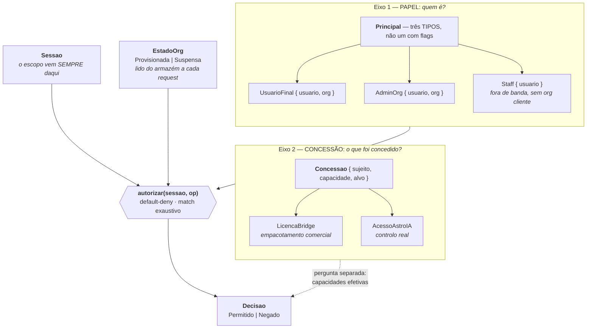
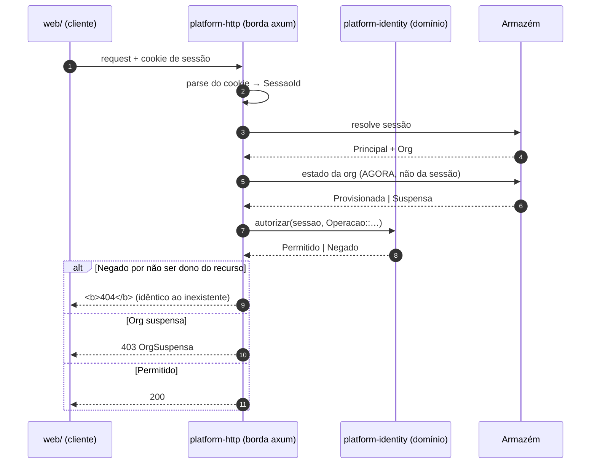

# 5. Autorização da plataforma

> **Medido contra:** `96a85934` (HEAD da `pre-prod`) · **em** 2026-08-31 · por Altair (Arquiteto)
> **Fonte:** `services/platform-identity`, `platform-concessao`, `platform-http`, `platform-org-admin`, `platform-back-office`
> **Scaffold nesta vista:** a plataforma é **nascente** — o domínio está escrito e testado; a borda HTTP entrou em fatias. `Sujeito::GrupoAad` está **deferido** de propósito.

## O que esta vista responde

Quem pode o quê — e **onde** isso é decidido, que é a pergunta que evita que a resposta se espalhe.

## Os dois eixos

## Fluxo de um request

## As decisões que sustentam isto, e o que cada uma impede

**1. `Principal` são três TIPOS, não um tipo com flags.** O tipo carrega a fronteira de confiança; a mais dura é *staff ↔ cliente*. 🔑 **Se `Staff` fosse um `Papel`, um `org_admin` podia concedê-lo** — e o back-office ficava alcançável de dentro de uma conta cliente. Ser um variante à parte torna essa escalada **inexprimível**, não apenas proibida.

**2. `Decisao` não tem terceiro estado, e a `Operacao` é exaustiva sem *catch-all*.** Adicionar uma variante a `Operacao` **quebra a compilação** até ganhar política explícita. É a guarda que obriga a **decidir**, em vez de confiar em que alguém se lembre.

**3. O escopo vem sempre da SESSÃO, nunca do payload.** `GET /me/...`, não `GET /users/<id>/...`. Se um id chega na rota, é **conferido** contra a sessão.

**4. Recurso de outro responde 404, não 403.** Um 403 confirma que o recurso existe — e transforma a autorização num oráculo de enumeração. ⚠️ **Não basta o status: a resposta tem de ser idêntica à do inexistente no fio**, senão o oráculo sobrevive na diferença.

**5. O `estado` da org é privado e só muda por TRANSIÇÃO.** Nasce `Provisionada`; `suspender`/`reativar` são as únicas portas. Não há literal público nem *setter*, portanto **ninguém forja "não suspensa" por fora**. E é lido **a cada request** — vale no acto, sem corrida de *"matar sessões"*. Sobrevivem à suspensão `/me`, `/me/orgs` e `DELETE /session`: sem isso o utilizador não alcança o ecrã que lhe explica a suspensão.

**6. Concessão só CONCEDE — "negar" não é representável.** Revogar é **remover a linha**, nunca acrescentar um "não". A resolução é **união**, nunca interseção, e por isso é monótona: acrescentar uma concessão nunca tira acesso. Um "negar" representável abriria a porta a conflitos de precedência, que é onde os modelos de autorização apodrecem.

**7. O `role` do M365 não é autorização nossa.** `MultiTenantMember` traz `role: "owner"|"member"` do Graph — isso é **topologia de tenant da Microsoft**. Se virasse a fonte de `org_admin`, quem administra o tenant M365 passava a administrar a org Galaxie.

**8. `LicencaBridge` chama-se *Licença* e não *Acesso* de propósito.** O Bridge fala com o M365 com a credencial **do próprio utilizador** — negar a capacidade é **empacotamento comercial**, não proteção: a pessoa abre a mesma porta pelo Outlook. 🔑 **O nome impede uma leitura falsa daqui a seis meses**, quando alguém vir "negado" e concluir que o dado está protegido. `AcessoAstroIA` chama-se *Acesso* porque o Astro **é** recurso nosso e negar barra de facto.

**9. `Sujeito` é enum FECHADO com `GrupoAad` deferido.** Quando o grupo entrar, o `match` da resolução **obriga** a decidir *"o utilizador pertence a este grupo?"* — em vez de nascer agora um braço irresolúvel.

**10. Domínio e borda são crates separados.** `platform-oauth` **decide** o que os bytes significam; `platform-http` **busca** os bytes. A segurança fica em código puro e testável, longe do I/O.

## Onde isto ainda não está fechado

- A borda HTTP entrou **em fatias**; nem toda a superfície do contrato está servida.
- `Capacidade` tem **duas** variantes hoje — o eixo existe, o catálogo é pequeno.
- `Sujeito::GrupoAad` espera a fatia de Graph/consent.
